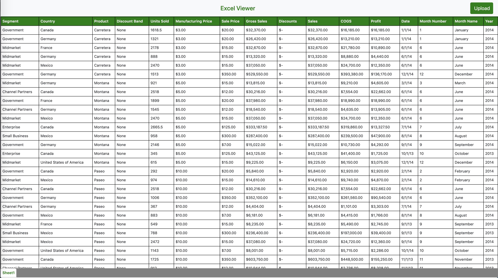

# excel-viewer

<b></bjs-text-reader>excel-viewer</b> is a simple excel sheet viewer. You can select a excel file from your system and view it in the browser. It is a simple example of sheetjs library. It don't have much support for every excel feature for now. But will work on that in future.

##### Below is a screenshot for the application:

  

### Getting Started

Just clone the repo and open <b>index.html</b> in browser and yes you now have a cool excel-viewer application.